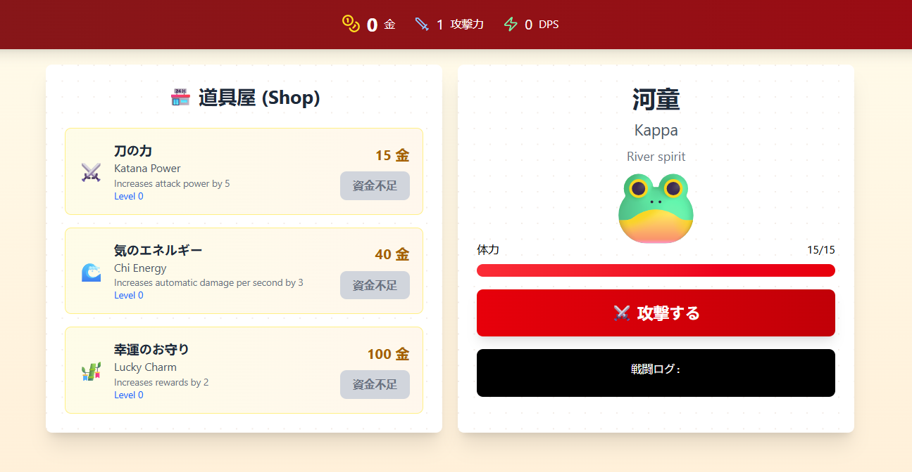

# 🍡 ClickHero: Japan Edition 🏮🏮🏮

**A fun and addictive clicker game built with React — inspired by Cookie Clicker and wrapped in a beautiful Japanese theme!**

Unleash your inner hero by clicking your way through traditional Japanese scenery, cute icons, and epic upgrades. Earn points, buy auto-clickers, unlock secret bonuses, and become the ultimate clicking samurai! 🥷

### 🎮 Features:
* ⚡ Smooth and responsive gameplay built with React
* 🏯 Upgrades and auto-clickers for passive income

### 🚧 Coming Soon:
* 🔊 Sound effects & background music (taiko drums, anyone?)
* 🔓 Hidden achievements and unlockables
* 💾 Local save system so your progress is never lost
* 🧙‍♂️ More upgrades and secrets...

---
Let the clicking journey begin! 🖱️✨  
Feel free to fork, star ⭐, or contribute!

---

## 🧰 Tech Stack

- 🧠 [React](https://reactjs.org/)
- ⚡ [Vite](https://vitejs.dev/)
- 💅 Tailwind (selon ton choix)
- 📦 State management (useState/context)

[//]: # (- 🎨 Custom assets &#40;Japanese-themed icons, fonts...&#41;)

## 🚀 Getting Started

Clone the project and run it locally:

```bash
# Clone the repo
git clone https://github.com/yourusername/clickhero-japan.git
cd clickhero-japan

# Install dependencies
npm install

# Run in dev mode
npm run dev
````

App will be available at: `http://localhost:5173/` (default Vite port)

## 📸 Demo



## 📁 Project Structure

```
src/
│
├── assets/              # Icons, images, fonts
├── components/          # UI Components (AttackButton, Monster, Shop, etc.)
├── hooks/               # Custom React hooks
├── utils/               # Externalize some game logic
├── App.jsx              # Root component
├── main.jsx             # App entry point
```

## 🧠 Game Logic Overview

* Clicking makes damage to monsters
* Monster death rewards you with gold
* You can buy upgrades that increase `clickPower` or generate `autoPoints/sec`
* State is handled via React state/hooks (or context)
* Save system planned via `localStorage` 🚧

## 🤝 Contributing

Want to add features, fix bugs, or localize the game? Awesome!

1. Fork the repo
2. Create your branch (`git checkout -b feature/cool-feature`)
3. Commit your changes (`git commit -am 'Add cool feature'`)
4. Push to the branch (`git push origin feature/cool-feature`)
5. Open a Pull Request ✅

[//]: # (## 📄 License)

[//]: # ()
[//]: # ([![License: MIT]&#40;https://img.shields.io/badge/License-MIT-yellow.svg&#41;]&#40;https://opensource.org/licenses/MIT&#41;)

---

**ありがとうございます for stopping by! 🙇‍♂️**
May your clicking spirit never fade 🍵
