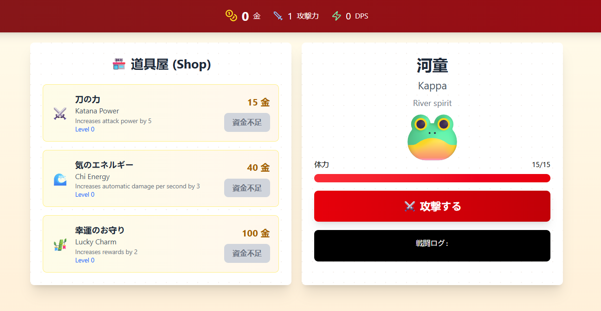

# 🍡 ClickHero: Japan Edition 🏮🏮🏮

**A fun and addictive clicker game built with React — inspired by Cookie Clicker and wrapped in a beautiful Japanese theme!**

Unleash your inner hero by clicking your way through traditional Japanese scenery, cute icons, and epic upgrades. Earn points, buy auto-clickers, unlock secret bonuses, and become the ultimate clicking samurai! 🥷

### 🎮 Features:
* ⚡ Smooth and responsive gameplay built with React
* 🏯 Upgrades and auto-clickers for passive income
* 💾 Local save system — progress survives a refresh, and can be reset from the header
* 📱 Plays on a phone as well as a desktop

### 🚧 Coming Soon:
* 🔊 Sound effects & background music (taiko drums, anyone?)
* 🔓 Hidden achievements and unlockables
* 🐉 An endless bestiary instead of five monsters on a loop
* 🧙‍♂️ More upgrades and secrets...

---
Let the clicking journey begin! 🖱️✨  
Feel free to fork, star ⭐, or contribute!

---

## 🧰 Tech Stack

- 🧠 [React](https://reactjs.org/)
- ⚡ [Vite](https://vitejs.dev/)
- 💅 Tailwind
- 📦 State management (`useReducer` + context)
- 🧪 Vitest + Testing Library

[//]: # (- 🎨 Custom assets &#40;Japanese-themed icons, fonts...&#41;)

## 🚀 Getting Started

Clone the project and run it locally:

```bash
# Clone the repo
git clone https://github.com/leopaul29/clickhero-clone.git
cd clickhero-clone

# Install dependencies
npm install

# Run in dev mode
npm run dev

# Run the gate that CI runs (types, lint, dead code, tests, build)
npm run verify
````

App will be available at: `http://localhost:5173/` (default Vite port)

## 📸 Demo



## 📁 Project Structure

```
src/
│
├── assets/              # Icons, images, fonts
├── components/          # UI Components (AttackButton, Monster, Shop, etc.)
├── contexts/            # Game context + provider
├── data/                # Monster and bonus content
├── hooks/               # Custom React hooks (one selector per concern)
├── state/               # gameReducer — every state transition, pure and testable
├── types/               # Shared types
├── utils/               # Game logic and localStorage persistence
├── App.tsx              # Root component
├── main.tsx             # App entry point
```

See `VERIFY.md` for the verify gate, which runs identically locally, on push and in CI.

## 🧠 Game Logic Overview

* Clicking makes damage to monsters
* Monster death rewards you with gold
* You can buy upgrades that increase attack power, generate damage per second, or
  multiply gold rewards — each upgrade declares its `effect`, so the shop can be
  reordered or extended without touching the logic
* Every state transition lives in `gameReducer.ts` and is pure, so a click and a
  DPS tick landing together cannot produce a stale read
* Progress is saved to `localStorage` (debounced, versioned, validated on load) 💾

## 🤝 Contributing

Want to add features, fix bugs, or localize the game? Awesome!

1. Fork the repo
2. Create your branch (`git checkout -b feature/cool-feature`)
3. Commit your changes (`git commit -am 'Add cool feature'`)
4. Push to the branch (`git push origin feature/cool-feature`)
5. Open a Pull Request ✅

## 📄 License

[](https://opensource.org/licenses/MIT)

---

**ありがとうございます for stopping by! 🙇‍♂️**
May your clicking spirit never fade 🍵
